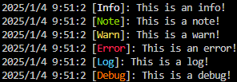
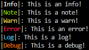
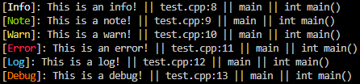
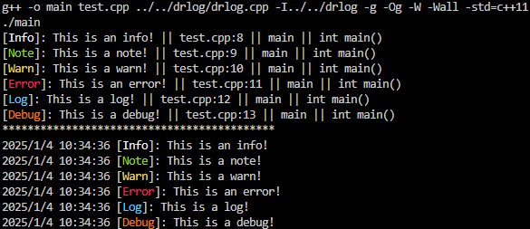
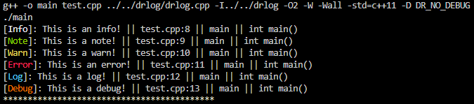
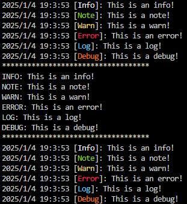
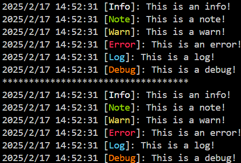

# <div align="center"> drlog </div>

## <div align="center">Directory</div>
- [Project Name](#project-name)
- [Project Introduction](#project-introduction)
- [Usage](#usage)

## Project Name
drlog

## Project Introduction
Drlog is a simple log library for c++.

## Usage
#### 1. Add Source file
Please add the drlog.cpp and drlog.h files from the drlog folder to the project.

#### 2. Quick Start
1. The simplest way to use<br>
The following is a simple tutorial of using drlog.
```cpp
#include "drlog.h"
#include <iostream>
using namespace std;

int main() {
    drlog::logger lg = drlog::logger();
    lg.info("This is an info!");
    lg.note("This is a note!");
    lg.warn("This is a warn!");
    lg.error("This is an error!");
    lg.log("This is a log!");
    lg.debug("This is a debug!");

    return 0;
}
```
Result:<br>


2. Custom format<br>
The following is a tutorial of using drlog with a custom format.
```cpp
#include "drlog.h"
#include <iostream>
using namespace std;

int main() {
    drlog::logger lg = drlog::logger("|{TYPE}|: {MESSAGE}");
    lg.info("This is an info!");
    lg.note("This is a note!");
    lg.warn("This is a warn!");
    lg.error("This is an error!");
    lg.log("This is a log!");
    lg.debug("This is a debug!");

    return 0;
}
```
Result:<br>


You can use the following variables in custom formats.
|Variable|Description|Note|
|---|---|---|
|{TYPE}|Log type|
|{MESSAGE}|Log content|
|{TIME}|Time|
|{YEAR}|Year|
|{MONTH}|Month|
|{DAY}|Day|
|{HOUR}|Hour|
|{MINUTE}|Minute|
|{SECOND}|Second|
|{FILE}|File name|Need to enable file information.|
|{LINE}|Line number|Need to enable file information.|
|{FUNCTION}|Function name|Need to enable file information.|
|{PRETTY_FUNCTION}|Function name with parameters|Need to enable file information.|


3. Enable file information<br>
The following is a tutorial of using drlog with file information enabled.<br>
Just pass a DR_INFO macro as an additional parameter on top of the original one.
```cpp
#include "drlog.h"
#include <iostream>
using namespace std;

int main() {
    drlog::logger lg("[{TYPE}]: {MESSAGE} || {FILE}:{LINE} || {FUNCTION} || "
                     "{PRETTY_FUNCTION}");
    lg.info("This is an info!", DR_INFO);
    lg.note("This is a note!", DR_INFO);
    lg.warn("This is a warn!", DR_INFO);
    lg.error("This is an error!", DR_INFO);
    lg.log("This is a log!", DR_INFO);
    lg.debug("This is a debug!", DR_INFO);
    return 0;
}
```
Result:<br>


4. Enable DEBUG mode<br>
The following is a tutorial of using drlog with DEBUG mode enabled.<br>
When the target information needs to be printed during the development phase but not during the release phase, simply wrap the target with the DR_DEBUG macro.
```cpp
#include "drlog.h"
#include <iostream>
using namespace std;

int main() {
    drlog::logger lg1("[{TYPE}]: {MESSAGE} || {FILE}:{LINE} || {FUNCTION} || "
                      "{PRETTY_FUNCTION}");
    lg1.info("This is an info!", DR_INFO);
    lg1.note("This is a note!", DR_INFO);
    lg1.warn("This is a warn!", DR_INFO);
    lg1.error("This is an error!", DR_INFO);
    lg1.log("This is a log!", DR_INFO);
    lg1.debug("This is a debug!", DR_INFO);

    cout << "*******************************************" << endl;

    drlog::logger lg2 = drlog::logger();
    DR_DEBUG(lg2.info("This is an info!"));
    DR_DEBUG(lg2.note("This is a note!"));
    DR_DEBUG(lg2.warn("This is a warn!"));
    DR_DEBUG(lg2.error("This is an error!"));
    DR_DEBUG(lg2.log("This is a log!"));
    DR_DEBUG(lg2.debug("This is a debug!"));
    return 0;
}
```
Result:
- Development(Not passed DR_NO_DEBUG macro):

- Release(Passed DR_NO_DEBUG macro):


5. Set output format and type style<br>
The following is a tutorial on using drlog to set output format and type styles.
```cpp
#include "drlog.h"
#include <iostream>
using namespace std;

int main() {
    drlog::logger lg;
    lg.info("This is an info!");
    lg.note("This is a note!");
    lg.warn("This is a warn!");
    lg.error("This is an error!");
    lg.log("This is a log!");
    lg.debug("This is a debug!");

    cout << "***********************************" << endl;

    lg.set_format("{TYPE}: {MESSAGE}");
    lg.set_debug_style("DEBUG");
    lg.set_info_style("INFO");
    lg.set_warn_style("WARN");
    lg.set_error_style("ERROR");
    lg.set_note_style("NOTE");
    lg.set_log_style("LOG");

    lg.info("This is an info!");
    lg.note("This is a note!");
    lg.warn("This is a warn!");
    lg.error("This is an error!");
    lg.log("This is a log!");
    lg.debug("This is a debug!");

    cout << "***********************************" << endl;

    lg.recover_format();
    lg.recover_all_type_style();

    lg.info("This is an info!");
    lg.note("This is a note!");
    lg.warn("This is a warn!");
    lg.error("This is an error!");
    lg.log("This is a log!");
    lg.debug("This is a debug!");

    return 0;
}
```
Result:<br>


6. Set output function<br>
The following is a tutorial on using drlog to set output functions.
```cpp
#include "drlog.h"
#include <cstdio>
#include <iostream>
using namespace std;

int main() {
    drlog::logger lg;
    lg.set_print([](std::string msg) { printf("%s\n", msg.c_str()); });
    lg.info("This is an info!");
    lg.note("This is a note!");
    lg.warn("This is a warn!");
    lg.error("This is an error!");
    lg.log("This is a log!");
    lg.debug("This is a debug!");

    cout << "***********************************" << endl;

    lg.recover_print();
    lg.info("This is an info!");
    lg.note("This is a note!");
    lg.warn("This is a warn!");
    lg.error("This is an error!");
    lg.log("This is a log!");
    lg.debug("This is a debug!");

    return 0;
}
```
Result:<br>

